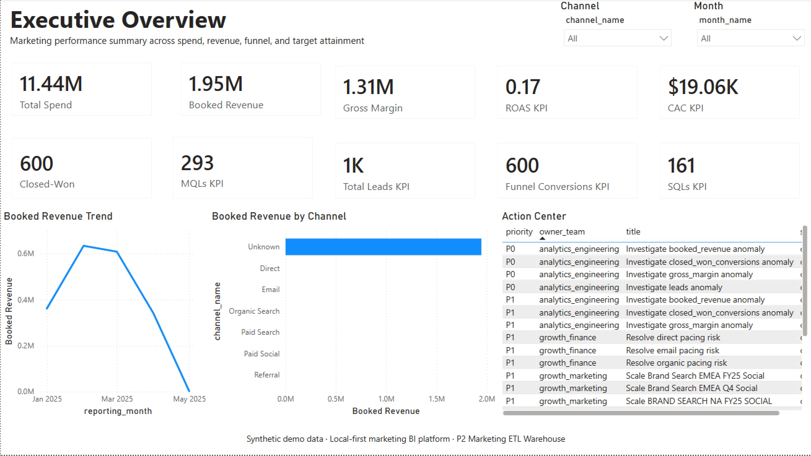
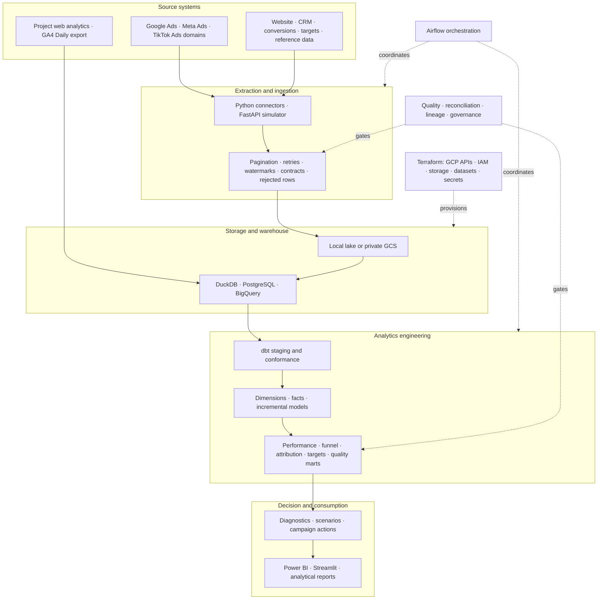
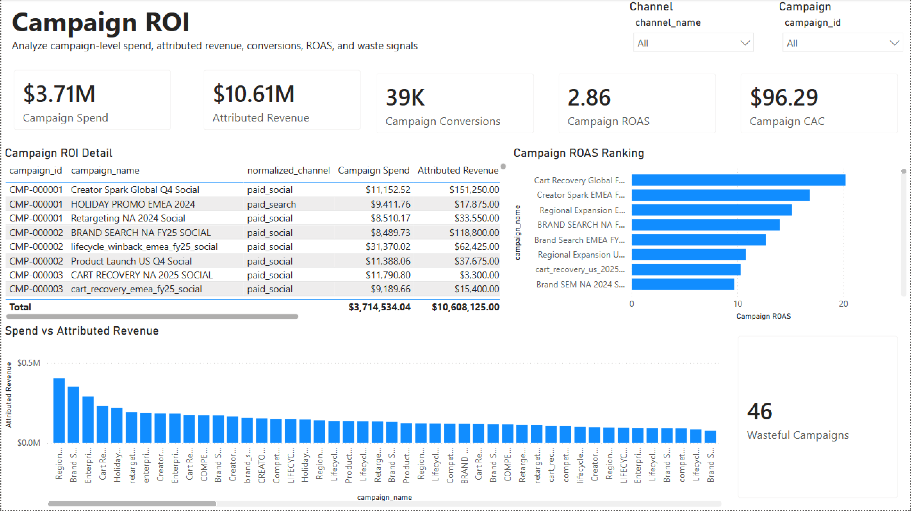
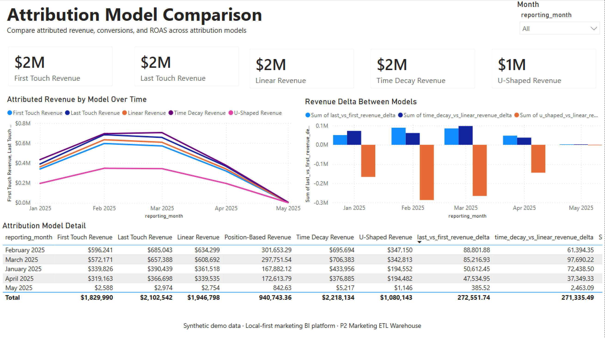
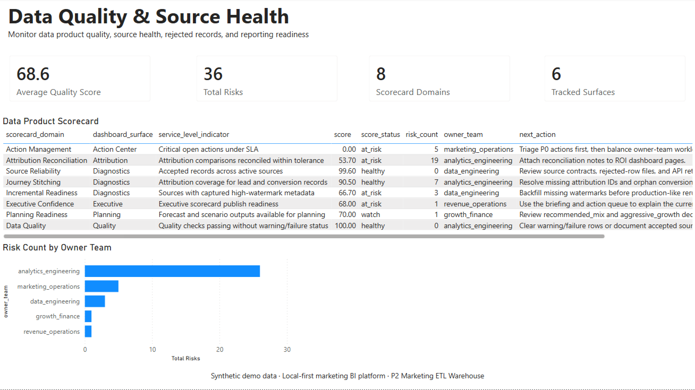

# Campaign ROI Reporting Automation & Marketing Performance Analytics Platform

An end-to-end marketing analytics platform that turns fragmented campaign, web, CRM, conversion, target, and GA4 data into governed warehouse models, transparent decision support, and executive BI reporting.

**Python · SQL · dbt · Airflow · PostgreSQL · DuckDB · BigQuery · FastAPI · Streamlit · Docker · Terraform · GCP · Power BI**

[](https://www.python.org/)
[](https://www.getdbt.com/)
[](https://airflow.apache.org/)
[](https://www.postgresql.org/)
[](https://cloud.google.com/bigquery)
[](https://learn.microsoft.com/power-bi/)

[](https://fastapi.tiangolo.com/)
[](https://streamlit.io/)
[](https://www.docker.com/)
[](https://www.terraform.io/)
[](https://cloud.google.com/)
[](https://github.com/darshil-mangukiya/marketing-etl-warehouse/actions/workflows/local-quality-gate.yml)

| Engineering check | Verified result |
|---|---:|
| Python quality | **100 tests passing · Ruff 0 findings** |
| Local dbt build | **96/96 operations** |
| Airflow orchestration | **28-task DAG** |
| Power BI semantic layer | **17 tables · 59 DAX measures** |
| Source-to-BI reconciliation | **42 PASS · 0 FAIL · 3 N/A** |
| Quality and security gates | **25/25 checks · 0 known dependency vulnerabilities · CI passing** |

### Executive performance and action priorities

This implemented Power BI page connects spend, revenue, funnel health, efficiency, and prioritized owner actions so leaders can assess performance and reporting trust together.

[](evidence/screenshots/powerbi/executive_overview.png)

## What makes this project different

- **Traceability reaches the dashboard.** Requirements connect to source fields, dbt transformations, governed KPIs, DAX measures, report surfaces, and modeled acceptance criteria.
- **Trust is engineered alongside analytics.** Reconciliation, source health, rejected-record handling, lineage, ownership, classification, and quality holds are part of the reporting workflow.
- **Recommendations remain explainable.** Scenario, anomaly, and campaign-action outputs use deterministic, inspectable rules with explicit thresholds, assumptions, and quality overrides.
- **The platform has real runtime depth.** A 28-task Airflow DAG, an eight-service Docker Compose topology, PostgreSQL, DuckDB, and cost-controlled BigQuery paths exercise more than static SQL files.
- **BI engineering is source controlled.** The repository contains an editable seven-page PBIX plus versionable semantic tables, DAX, relationships, page specifications, and RLS role definitions.
- **Validation spans local and cloud paths.** GA4 events were verified through Daily BigQuery export and dbt, while advertising connectors are contract- and failure-tested locally.

## Business problem and supported decisions

Marketing reporting commonly arrives as disconnected platform exports, web events, CRM records, sales conversions, and target spreadsheets. Teams then debate metric definitions instead of deciding where to invest: ROAS and CAC disagree, attribution changes the answer, funnel leakage is hard to locate, target variance lacks ownership, and data-quality issues are discovered too late.

This platform creates one governed path from source records to decision-ready reporting while preserving the context needed to explain how each KPI was produced.

| Business question | Decision-support output |
|---|---|
| Which campaigns are consuming budget without sufficient return? | Campaign ROI and Campaign Action Center |
| Which channels should be scaled, monitored, or reduced? | Channel Performance, ROAS/CAC diagnostics, and transparent action rules |
| Where does the customer journey break? | Funnel Analysis and GA4 ecommerce funnel |
| How does attribution methodology change the conclusion? | First-touch, last-touch, linear, time-decay, and position-based comparison |
| Are teams meeting spend, lead, and revenue targets? | Target vs Actual and variance-driver analysis |
| What changes under alternative budget assumptions? | Deterministic scenario-planning outputs |
| Can leaders trust the reported result? | Reconciliation, source health, data-quality monitoring, and reporting controls |

## Architecture



Terraform provisions infrastructure outside the data-processing graph. The local pipeline and GA4-to-BigQuery path use separate sources and models, keeping web analytics telemetry distinct from generated advertising data.

## Technology map and platform capabilities

| Layer | Technology |
|---|---|
| Languages | Python · SQL |
| Transformation | dbt |
| Orchestration | Apache Airflow |
| Data platforms | PostgreSQL · DuckDB · BigQuery |
| APIs and applications | FastAPI · Streamlit |
| Cloud | GCP · Google Cloud Storage (GCS) · IAM · Secret Manager |
| Infrastructure | Terraform · Docker Compose |
| Web analytics | GA4 |
| BI and semantic modeling | Power BI · DAX · TMDL · RLS |
| Quality and security | pytest · Ruff · pip-audit |
| Automation | GitHub Actions |

| Capability | What is implemented |
|---|---|
| Ingestion | Google Ads, Meta Ads, and TikTok Ads connector architecture; pagination, retry/backoff, rate-limit handling, OAuth refresh support, watermarks, normalization, processed-file state, idempotent reruns, audit metadata, and rejected-row outputs |
| Warehouse | Raw schemas, conformed dimensions, reusable facts, SCD2 campaign logic, four incremental facts, late-arriving update handling, and explicit model grains |
| Analytics | ROAS, CAC, revenue, funnel conversion, target variance, attribution comparison, anomaly detection, scenario analysis, and campaign action recommendations |
| BI | Editable Power BI Desktop report, source-controlled semantic assets, governed DAX, Power BI-ready handoff data, and a nine-page Streamlit application |
| Trust | Contracts, dbt tests, reconciliation, KPI catalog, data dictionary, lineage, PII classification, source health, semantic regression, and report governance |
| Platform | FastAPI source simulation, Streamlit analysis, Airflow orchestration, Docker Compose runtimes, GitHub Actions, and a Terraform-managed GCP foundation |

## Data sources and connector framework

| Source class | Scope |
|---|---|
| Paid media | Google Ads, Meta Ads, and TikTok Ads domains |
| Digital analytics | Web analytics and GA4 event domains for local and BigQuery validation |
| Customer and revenue | CRM leads and sales conversions |
| Planning and reference | Marketing targets, campaign mapping, and region mapping |
| Verified web source | GA4 telemetry exported daily to BigQuery |

The connector framework translates representative Google Ads, Meta Ads, and TikTok Ads payloads into a shared campaign schema. A FastAPI source simulator exercises bearer authentication, pagination, watermarks, rate-limit metadata, and retryable failures, while the OAuth refresh client keeps token renewal separate from extraction logic. Vendor execution uses account-specific authorization.

The GA4 path processes events from [the project's web analytics stream](https://p2.darshilmangukiya.com) through Daily BigQuery export, hostname filtering, nested event parsing, repeated ecommerce items, sessionization, and funnel models.

## dbt and warehouse engineering

The dbt project builds a dimensional data warehouse and star schema while keeping adapter-aware logic in macros and model configuration rather than maintaining separate SQL projects for every engine. DuckDB provides the local verification path, PostgreSQL exercises a relational warehouse runtime, and BigQuery supports the cloud and GA4 paths.

| Model layer | Physical SQL files | Enabled on DuckDB | Responsibility |
|---|---:|---:|---|
| Staging | 12 | 10 | Type enforcement, source standardization, naming, and accepted vocabularies |
| Intermediate | 6 | 5 | Cross-source conformance, sessionization, campaign daily grain, and attribution touchpoints |
| Core warehouse | 17 | 17 | Conformed dimensions, reusable facts, targets, revenue, and time spine |
| Reporting marts | 13 | 12 | Campaign, channel, funnel, attribution, target, customer, GA4, and quality outputs |
| **Total** | **48** | **44** | **One governed transformation graph** |

The DuckDB build executes **44 enabled models + 52 data tests = 96/96 successful operations**. Four live-GA4 models are BigQuery-specific—nested event extraction, repeated ecommerce items, privacy-conscious sessionization, and the live funnel—and are intentionally excluded from the local DuckDB graph.

Engineering patterns include:

- Four incremental fact models with stable unique keys and `updated_at` lookbacks.
- Campaign SCD2 window validation and conformed campaign, channel, date, region, device, product, customer, sales-rep, and source dimensions.
- Explicit grain and uniqueness tests for facts and reporting marts.
- Safe division, channel normalization, surrogate-key, date, and adapter-portability macros.
- Late-arriving conversion handling through source watermarks and affected-period refresh logic.

## Analytics and decision intelligence

The analytical layer moves beyond descriptive charts without hiding its reasoning:

- **Performance:** spend, revenue, gross margin, ROAS, CAC, CPL, conversion, and customer value.
- **Journey:** lead-to-MQL, MQL-to-SQL, SQL-to-close, GA4 ecommerce stages, and conversion lag.
- **Attribution:** first touch, last touch, linear, time decay, and position-based comparisons with reconciliation tests.
- **Planning:** target attainment, budget efficiency, variance drivers, and explicit scenario assumptions.
- **Action:** campaign-level `SCALE`, `MONITOR`, `REDUCE`, `FIX FUNNEL`, `REVIEW TARGET`, and `DATA QUALITY HOLD` recommendations.

The anomaly, scenario, and action-center logic is deterministic and transparent. Each output exposes its baseline, assumption, threshold, reason, or quality override so it remains testable and suitable for human review.

## Power BI and semantic engineering

The repository deliberately separates what exists in the binary report from what is available as version-controlled design.

| Asset | Verified scope |
|---|---:|
| Physical Power BI Desktop report | **7 implemented pages** |
| Source-controlled page specifications | **11 specifications** |
| Semantic tables | **17** |
| DAX measures | **59** |
| TMDL relationships | **9** |
| Import/handoff relationship map | **11** |
| Source-controlled RLS roles | **3 definitions** |

The seven physical PBIX pages are distinct from the 11 source-controlled page specifications. The three RLS definitions are source-controlled assets. Power BI Service deployment, scheduled refresh, Desktop View as role, and Service-side enforcement are operating steps.

A separate **nine-page Streamlit application** supports interactive executive, channel, campaign, funnel, attribution, target, quality, customer-value, and source-health analysis.

### Campaign ROI and waste signals

This implemented Power BI page ranks campaign spend, attributed revenue, ROAS, and waste signals to support scale, monitor, or reduce decisions.

[](evidence/screenshots/powerbi/campaign_roi.png)

### Attribution sensitivity

This implemented Power BI page compares revenue allocation across attribution methods so analysts can quantify how model choice changes the conclusion.

[](evidence/screenshots/powerbi/attribution_model_comparison.png)

## Business analysis and traceability

The project begins with decision needs rather than dashboard visuals:

- **24 modeled requirements** covering executive performance, channel/campaign analysis, funnel, targets, attribution, data quality, and platform behavior.
- Source assessment, stakeholder needs, user stories, acceptance criteria, current/future process analysis, and implementation-change impact.
- Requirement-to-source-to-model-to-KPI-to-report traceability, with field identifiers tied to the governed dictionary.
- **40 modeled UAT cases** spanning data, transformation, semantic, dashboard, security, usability, and operational scenarios.

The UAT plan separates automatable checks from GUI and credential-dependent cases; stakeholder execution and sign-off complete the acceptance process.

## Governance, quality, lineage, and security

Automated checks enforce reporting trust before artifacts are published.

| Control surface | Verified result |
|---|---|
| Source-to-BI reconciliation | 45 controls: 42 PASS, 0 FAIL, 3 N/A |
| BI semantic regression | 27/27 retained checks passing |
| Data contracts and validation | Source-specific rules, accepted/rejected separation, and quality thresholds |
| KPI governance | Definition, grain, aggregation, owner, and report usage |
| Lineage | Source fields through warehouse models, marts, DAX, and report surfaces |
| Privacy and access | Classification, PII discovery, access matrix, retention dry run, and RLS design |
| Credential and infrastructure safety | Environment-based configuration, keyless cloud access, excluded state/plans, and empty Secret Manager containers |
| Dependency and delivery quality | pytest, Ruff, pip-audit, semantic regression, local quality gate, and GitHub Actions |

Campaign recommendations can be replaced by `DATA QUALITY HOLD` when source or model quality is insufficient. This prevents a high-performing-looking metric from automatically becoming an action when its inputs are not trustworthy.

### Reporting trust and source health

This implemented Power BI page surfaces quality scores, source reliability, ownership, risk, and next actions before reporting decisions are released.

[](evidence/screenshots/powerbi/data_quality_source_health.png)

## Runtime and cloud infrastructure

### Airflow and Docker Compose

The Airflow DAG contains **28 tasks** across the following lifecycle:

`Generate → Extract → Ingest → Validate → Load → dbt → BI export → Decision intelligence → Governance and reporting`

Airflow orchestrates the ETL lifecycle while dbt performs ELT transformations across staging, intermediate, core warehouse, and reporting-mart layers.

A recorded local Docker run completed with **26 successful tasks, two expected branch skips, and zero failures**.

Docker Compose defines **eight services** spanning PostgreSQL, Airflow initialization/webserver/scheduler, ingestion, the FastAPI simulator, Streamlit, and dbt.

### GCP and Terraform

Terraform provisioning and post-apply checks completed successfully in `us-central1`:

- **21 Terraform-managed resource instances**, including required API enablement and scoped project-, dataset-, bucket-, and secret-level IAM.
- **Four BigQuery datasets** separating raw, staging, warehouse, and mart responsibilities.
- One private, versioned GCS bucket with public-access prevention.
- One keyless pipeline service account; no service-account keys are created.
- Three empty Secret Manager containers; no advertising secret versions were populated.
- BigQuery execution with a 100 MiB per-query ceiling for the verification path.

The verified path covers infrastructure, access, storage, transformation, and GA4 Daily export integration. It is cost-controlled and does not include a continuously scheduled cloud workload.

## Engineering decisions and tradeoffs

| Decision | Why | Tradeoff |
|---|---|---|
| DuckDB for local verification | Fast, reproducible dbt execution without infrastructure | BigQuery handles the cloud warehouse path |
| PostgreSQL for the local warehouse service | Exercises relational schemas, indexes, views, and container integration | Adds more setup than the fastest review path |
| BigQuery for cloud verification | Supports GCP validation and native GA4 Daily export structures | Scope and query cost must remain controlled |
| Locally validated vendor connector interfaces | Provides reproducible failure coverage while avoiding credential and privacy risk | Does not prove live advertising API authorization |
| Deterministic decision logic | Recommendations, scenarios, and anomalies stay explainable and testable | Does not attempt predictive or causal modeling |
| Architecture proportional to the workload | Airflow, dbt, relational/cloud warehouses, and containers cover the demonstrated needs | Kafka, Spark, and Kubernetes are excluded because the workload does not justify them |

## Repository structure

```text
.
├── airflow/                 # 28-task orchestration DAG and callbacks
├── analytics/               # attribution, anomaly, and scenario logic
├── api_simulator/           # local paginated FastAPI source simulator
├── business_analysis/       # requirements, traceability, process, and UAT assets
├── cloud_platform/          # GCS, BigQuery, and Secret Manager abstractions
├── connectors/              # locally validated vendor extraction framework
├── dashboards/powerbi/      # PBIX, exported marts, DAX, and build assets
├── dbt/                     # staging, intermediate, warehouse, marts, and tests
├── governance/              # classification, policy, and report-governance assets
├── ingestion/               # landing, validation, metadata, and watermarks
├── semantic_layer/          # KPI catalog, PBIP/TMDL, relationships, and roles
├── terraform/               # GCP infrastructure as code
├── tests/                   # Python validation suite
└── warehouse/               # PostgreSQL schemas, views, and bootstrap SQL
```

## Quick start

No GCP project or advertising credentials are required for local evaluation.

### Quick validation

```bash
python3 -m venv .venv
source .venv/bin/activate
python3 -m pip install --upgrade pip
python3 -m pip install -r requirements.txt
python3 -m pip install "ruff>=0.5"

ruff check . --no-cache
python3 -m pytest -q -p no:cacheprovider
python3 -B scripts/run_smoke_pipeline.py
python3 -B scripts/load_duckdb_raw.py
dbt build --project-dir dbt --profiles-dir dbt --target duckdb
```

### Full local stack

```bash
cp .env.example .env
docker compose up -d --build postgres airflow-init airflow-webserver airflow-scheduler
docker compose up -d --build api-simulator dashboard
docker compose ps
```

Local endpoints:

- Airflow: `http://localhost:8080`
- FastAPI documentation: `http://localhost:8000/docs`
- Streamlit: `http://localhost:8501`

Trigger `marketing_platform_daily` from Airflow to run the orchestrated PostgreSQL/dbt lifecycle.

The credentials in `.env.example` are local development defaults only. Override them for non-local use and never commit a real `.env` file.

## Project status and production evolution

| Area | Status |
|---|---|
| Technical implementation | Complete for the documented scope |
| Local validation | 100 pytest tests, 96/96 dbt operations, 25/25 quality-gate checks, and 0 known dependency vulnerabilities |
| Repository | Published at [marketing-etl-warehouse](https://github.com/darshil-mangukiya/marketing-etl-warehouse) |
| Cloud and GA4 | Terraform provisioning, GCP access, GA4 Daily export, and BigQuery/dbt transformation verified |
| GitHub Actions | Passing on `main` |
| External operating steps | Vendor account authorization, Power BI Service deployment, and stakeholder UAT |

### Scope

Live checks cover the project-site GA4 stream and documented GCP resources. Paid-media account authorization, Power BI Service deployment and refresh, runtime RLS impersonation, stakeholder-executed UAT, and continuously operated commercial workloads remain separate operating steps.

### Production evolution

A commercial implementation would add controls justified by its operating requirements:

- Complete vendor OAuth, consent, quota, and account onboarding for advertising APIs.
- Move secrets, workload identity, network boundaries, and access review into managed operating controls.
- Add remote locked Terraform state with protected deployment environments and approvals.
- Pin and attest deployable images and packages with stronger supply-chain policy.
- Define production SLOs, incident ownership, disaster recovery, and monitored scheduling around agreed refresh commitments.

## Explore the project

- [Architecture and execution modes](docs/cloud_architecture.md)
- [Connector architecture](docs/api_connectors.md)
- [Business requirements](business_analysis/business_requirements.md)
- [Warehouse model](docs/warehouse_model.md)
- [KPI lineage](docs/lineage/kpi_lineage.md)
- [Power BI dashboard](dashboards/powerbi/README.md)
- [Data-quality framework](docs/data_quality_framework.md)
- [Incremental loading](docs/incremental_load_evidence.md)
- [GCP and GA4 validation](docs/P2_LIVE_GCP_VALIDATION.md)
- [Local setup guide](docs/setup_guide.md)
