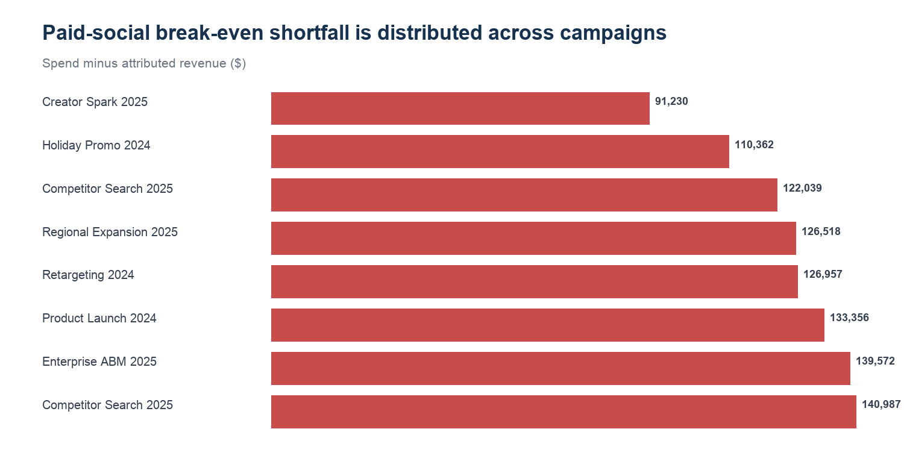

# REQ-01 — Paid-social ROAS deterioration review

**Scenario type:** Modeled stakeholder request / portfolio case study
**Modeled requester:** VP Marketing

## 1. Request ID

`REQ-01`

## 2. Modeled requester / persona

VP Marketing. This is a functional persona, not a record of an actual stakeholder interaction.

## 3. Original business question

> Why is paid-social ROAS materially below the review line in the latest available campaign period?

## 4. Clarifying questions

- Use attributed revenue, not platform conversion value? — Yes; use the governed campaign mart.
- What comparison is defensible? — Compare with a 1.0x break-even review line because no matched governed paid-social target is present.
- Should this trigger an automatic budget change? — No; recommendations require human review and quality checks.

## 5. Restated analytical question

Which paid-social campaigns contribute most to the gap between spend and attributed revenue, and is the gap concentrated enough for a targeted response?

## 6. Data sources / marts used

- `mart.mart_campaign_performance`
- `mart.mart_campaign_action_center`
- `mart.mart_data_quality_monitoring`

## 7. Relevant grain

One row per campaign and reporting month; this analysis filters the latest available paid-social campaign period.

## 8. SQL and/or Python analysis

- Reproducible Python: `../build_analysis_pack.py`
- Inspectable SQL: `analysis.sql`

## 9. Validation / reconciliation checks

- Result spend and revenue reconcile to the filtered governed mart.
- ROAS is recalculated as attributed revenue / spend.
- Campaign IDs are non-null in the selected result.
- Quality status is reviewed separately before action release.

## 10. Output table

See `result.csv`.

## 11. Visualization

## 12. What happened? — OBSERVATION

The January paid-social campaign mart reports $1,203,353 of spend and $34,405 of attributed revenue, or 0.03x attributed ROAS. All 11 campaign rows are below the 1.0x review line.

## 13. Why did it happen? — INTERPRETATION

The two largest campaign shortfalls represent only 24.0% of the total, so the weak return is portfolio-wide rather than isolated to one campaign. This is an association in the generated mart, not evidence of causal lift or loss.

## 14. So what? — BUSINESS INTERPRETATION

A campaign-only fix would leave most of the observed shortfall unaddressed; measurement and portfolio structure both warrant review.

## 15. Recommended action — HUMAN REVIEW REQUIRED

Hold broad scaling. Review campaign mapping and attribution coverage first, then inspect the eight listed campaigns for audience, creative, placement, and conversion-tracking issues before any budget decision.

## 16. Risks / caveats

- The available governed campaign data covers one paid-media period, so this is a weak-return diagnostic rather than a causal time-series claim.
- Attribution allocates observed revenue; it does not estimate incremental lift.
- Generated business data cannot support a real budget action.

## 17. Evidence / provenance

`validation.json` records the input hashes, result hash, schema, row count, and checks. All business data is generated/synthetic. The bounded real GA4 path is not used in this request.

## 18. Final concise stakeholder response

Paid social is at 0.03x attributed ROAS in the latest available campaign period. The largest two shortfalls explain only 24.0%, so this is not a single-campaign problem. I recommend a portfolio-level measurement and campaign review before reallocating spend.
