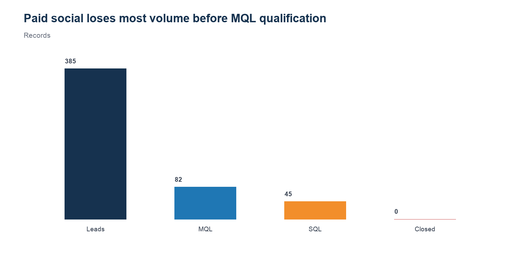

# REQ-02 — Lead-to-close funnel leakage

**Scenario type:** Modeled stakeholder request / portfolio case study
**Modeled requester:** Sales Operations Manager

## 1. Request ID

`REQ-02`

## 2. Modeled requester / persona

Sales Operations Manager. This is a functional persona, not a record of an actual stakeholder interaction.

## 3. Original business question

> Where is the largest Lead → MQL → SQL → Close leakage, and what should we inspect first?

## 4. Clarifying questions

- Measure absolute lost volume or conversion rate? — Use both, prioritizing absolute lost volume.
- Which cohort? — Latest non-empty lead cohort in the governed funnel mart.
- Can later-stage counts exceed the same-month lead cohort? — Yes; treat those rows as cohort-timing limitations, not negative leakage.

## 5. Restated analytical question

Across channels, which stage loses the most records, with a focused diagnosis of the largest internally consistent funnel?

## 6. Data sources / marts used

- `mart.mart_funnel_performance`
- `mart.mart_data_quality_monitoring`

## 7. Relevant grain

One row per reporting month and channel. Stage counts can reflect different conversion timing, so negative raw differences are clipped only for leakage presentation and flagged as a caveat.

## 8. SQL and/or Python analysis

- Reproducible Python: `../build_analysis_pack.py`
- Inspectable SQL: `analysis.sql`

## 9. Validation / reconciliation checks

- Only rows with positive lead cohorts are included.
- Paid-social stage counts are monotonically decreasing.
- Stored funnel rates are reconciled to stage counts.

## 10. Output table

See `result.csv`.

## 11. Visualization

## 12. What happened? — OBSERVATION

Paid social has the largest absolute top-of-funnel leakage: 303 of 385 leads do not reach MQL (78.7%). Review lead-source fit and qualification rules before focusing on the smaller downstream losses.

## 13. Why did it happen? — INTERPRETATION

The loss occurs before marketing qualification, so it is associated with lead-source mix, scoring thresholds, or incomplete qualification—not primarily with close-stage execution.

## 14. So what? — BUSINESS INTERPRETATION

Optimizing SQL-to-close would address a much smaller pool than improving lead quality and the lead-to-MQL handoff.

## 15. Recommended action — HUMAN REVIEW REQUIRED

Sample rejected/unqualified paid-social leads, compare lead-score distributions by campaign, and review the MQL definition with Sales Operations before changing media spend.

## 16. Risks / caveats

- This is descriptive funnel evidence and does not prove why a lead failed qualification.
- Conversions can occur after the lead month; some channel rows therefore require cohort-aware follow-up.
- All business records are generated/synthetic.

## 17. Evidence / provenance

`validation.json` records the input hashes, result hash, schema, row count, and checks. All business data is generated/synthetic. The bounded real GA4 path is not used in this request.

## 18. Final concise stakeholder response

Paid social has the largest absolute top-of-funnel leakage: 303 of 385 leads do not reach MQL (78.7%). Review lead-source fit and qualification rules before focusing on the smaller downstream losses.
