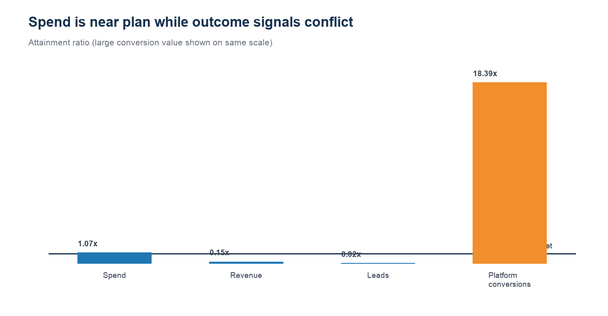

# REQ-03 — Revenue target miss despite near-plan spend

**Scenario type:** Modeled stakeholder request / portfolio case study
**Modeled requester:** Finance Business Partner

## 1. Request ID

`REQ-03`

## 2. Modeled requester / persona

Finance Business Partner. This is a functional persona, not a record of an actual stakeholder interaction.

## 3. Original business question

> Why did LATAM Paid Search miss revenue target even though spend was approximately on plan?

## 4. Clarifying questions

- Which target record? — Use the closest spend-to-plan record with revenue attainment below 50%.
- Which revenue? — Governed attributed revenue from the target-vs-actual mart.
- Should platform conversions be treated as closed revenue? — No; they are a separate signal and require reconciliation.

## 5. Restated analytical question

For the selected target record, do lead volume, attributed revenue, and platform conversions tell a consistent story about the miss?

## 6. Data sources / marts used

- `mart.mart_target_vs_actual`
- `mart.mart_attribution_reconciliation`
- `mart.mart_data_quality_monitoring`

## 7. Relevant grain

One generated target record by target month, region, channel, budget owner, and target values.

## 8. SQL and/or Python analysis

- Reproducible Python: `../build_analysis_pack.py`
- Inspectable SQL: `analysis.sql`

## 9. Validation / reconciliation checks

- Spend, revenue, lead, and conversion attainment are recalculated from target and actual values.
- The selected record falls within the defined 80%–120% spend band.
- Conflicting platform-conversion and revenue signals trigger a measurement-mismatch flag.

## 10. Output table

See `result.csv`.

## 11. Visualization

## 12. What happened? — OBSERVATION

For the selected LATAM Paid Search target record, spend reached 107.3%, but attributed revenue reached only 14.6% and leads 1.8%. Platform conversions reached 1839.1%, so the signals do not reconcile; validate conversion definitions and joins before treating this as a pure performance miss.

## 13. Why did it happen? — INTERPRETATION

The miss is associated with very low lead and attributed-revenue attainment, while platform conversions exceed target by more than ten times. That divergence indicates definition, attribution, or join risk rather than a clean efficiency narrative.

## 14. So what? — BUSINESS INTERPRETATION

A finance recommendation based on only one of these signals could be materially misleading.

## 15. Recommended action — HUMAN REVIEW REQUIRED

Reconcile platform conversion definitions to lead and booked-revenue records, then rerun the target review. Keep the budget recommendation in review status until the mismatch is explained.

## 16. Risks / caveats

- This is a selected generated target record, not an organizational forecast or approved plan.
- Actuals can repeat across target dimensions; analysis remains at the individual target-record grain and does not sum duplicated actuals.
- The analysis identifies inconsistency, not causality.

## 17. Evidence / provenance

`validation.json` records the input hashes, result hash, schema, row count, and checks. All business data is generated/synthetic. The bounded real GA4 path is not used in this request.

## 18. Final concise stakeholder response

For the selected LATAM Paid Search target record, spend reached 107.3%, but attributed revenue reached only 14.6% and leads 1.8%. Platform conversions reached 1839.1%, so the signals do not reconcile; validate conversion definitions and joins before treating this as a pure performance miss.
