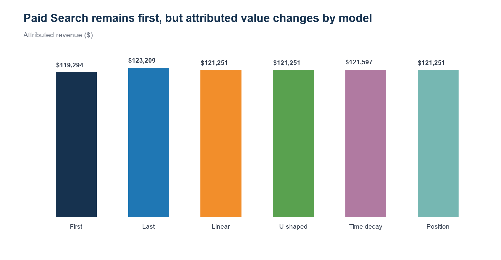

# REQ-04 — Attribution sensitivity

**Scenario type:** Modeled stakeholder request / portfolio case study
**Modeled requester:** Marketing Analytics Manager

## 1. Request ID

`REQ-04`

## 2. Modeled requester / persona

Marketing Analytics Manager. This is a functional persona, not a record of an actual stakeholder interaction.

## 3. Original business question

> How much does our channel conclusion change when the attribution methodology changes?

## 4. Clarifying questions

- Compare which methods? — First touch, last touch, linear, U-shaped, time decay, and position based.
- Decision lens? — Test both channel rank and allocated-revenue magnitude.
- Does model difference imply lift? — No; this is allocation sensitivity only.

## 5. Restated analytical question

Is the leading channel stable across six allocation methods, and how wide is the attributed-revenue range?

## 6. Data sources / marts used

- `mart.mart_attribution_model_comparison`
- `mart.mart_attribution_summary`
- `mart.mart_attribution_reconciliation`

## 7. Relevant grain

Aggregated channel totals across available reporting months and campaigns; each attribution method remains a separate allocation column.

## 8. SQL and/or Python analysis

- Reproducible Python: `../build_analysis_pack.py`
- Inspectable SQL: `analysis.sql`

## 9. Validation / reconciliation checks

- Six required attribution methods are present.
- Channel totals reconcile to the comparison mart.
- Rank and spread are recalculated from attributed-revenue fields.

## 10. Output table

See `result.csv`.

## 11. Visualization

## 12. What happened? — OBSERVATION

Paid Search ranks first under all six attribution methods (stable ranking), but its allocated revenue ranges from $119,294 to $123,209, a 3.2% spread versus linear attribution. The direction is robust; the magnitude is model-sensitive.

## 13. Why did it happen? — INTERPRETATION

Model weighting changes how multi-touch revenue is allocated, especially between first and later touchpoints; it does not create or remove underlying revenue.

## 14. So what? — BUSINESS INTERPRETATION

Channel priority is directionally stable in this generated dataset, but a business case that relies on an exact revenue amount should show a sensitivity range.

## 15. Recommended action — HUMAN REVIEW REQUIRED

Use the stable rank for review prioritization, disclose the model range in executive reporting, and avoid presenting any method as causal incrementality.

## 16. Risks / caveats

- Attribution methods redistribute observed revenue and do not measure causal lift.
- The result aggregates across periods and campaigns; campaign-level sensitivity can be larger.
- Generated journeys may not reflect a real channel mix.

## 17. Evidence / provenance

`validation.json` records the input hashes, result hash, schema, row count, and checks. All business data is generated/synthetic. The bounded real GA4 path is not used in this request.

## 18. Final concise stakeholder response

Paid Search ranks first under all six attribution methods (stable ranking), but its allocated revenue ranges from $119,294 to $123,209, a 3.2% spread versus linear attribution. The direction is robust; the magnitude is model-sensitive.
