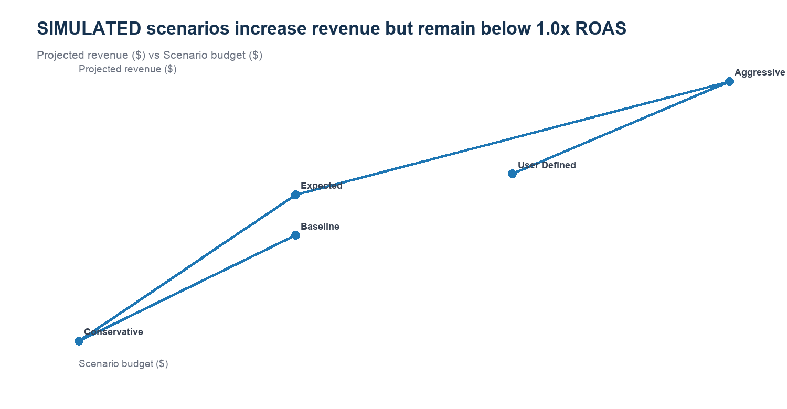

# REQ-05 — Budget reallocation review

**Scenario type:** Modeled stakeholder request / portfolio case study
**Modeled requester:** Performance Marketing Manager

## 1. Request ID

`REQ-05`

## 2. Modeled requester / persona

Performance Marketing Manager. This is a functional persona, not a record of an actual stakeholder interaction.

## 3. Original business question

> Which areas should be reviewed if budget needs to be reallocated?

## 4. Clarifying questions

- Is this an optimization? — No; it is deterministic what-if analysis.
- Can we execute a budget change? — No; no ad account is connected and all actions require human review.
- Which scenario is the decision anchor? — Use Expected, with Baseline, Conservative, Aggressive, and User Defined as sensitivity cases.

## 5. Restated analytical question

How do budget, projected revenue, ROAS, CAC, and channel concentration change under the existing deterministic scenarios?

## 6. Data sources / marts used

- `analytics_requests/canonical_input/mart_budget_scenarios.csv`
- `deterministic_budget_funnel_simulation (upstream methodology)`

## 7. Relevant grain

One output row per simulated scenario; source detail is one row per scenario and channel.

## 8. SQL and/or Python analysis

- Reproducible Python: `../build_analysis_pack.py`
- Inspectable SQL: `analysis.sql`

## 9. Validation / reconciliation checks

- Every source row is labeled SIMULATED.
- Scenario budgets and projected revenue reconcile to channel detail.
- Projected ROAS and CAC are recalculated from scenario totals.

## 10. Output table

See `result.csv`.

## 11. Visualization

## 12. What happened? — OBSERVATION

In the SIMULATED Expected case, 70.8% of budget remains in paid social, projected ROAS is 0.18x, and projected CAC is $20,172. Every modeled scenario remains below 1.0x ROAS, so the output supports a review of assumptions and concentration—not an automatic reallocation.

## 13. Why did it happen? — INTERPRETATION

The modeled allocation preserves the baseline paid-search/paid-social mix and applies scenario-specific CPC and conversion assumptions. The aggressive case improves modeled ROAS but also increases exposure to those assumptions.

## 14. So what? — BUSINESS INTERPRETATION

No scenario provides evidence of an optimal or causal allocation; the scenario pack is a structured sensitivity test for where review effort should go.

## 15. Recommended action — HUMAN REVIEW REQUIRED

Review paid-social concentration, conversion assumptions, and the 1.0x review line. If a real decision were in scope, run a controlled experiment and add capacity/volume constraints before reallocating.

## 16. Risks / caveats

- SIMULATED / WHAT-IF only; no real advertising budget is changed.
- The framework is deterministic and does not model diminishing returns or causal response.
- Projected revenue and customers are scenario outputs, not forecasts or realized impact.

## 17. Evidence / provenance

`validation.json` records the input hashes, result hash, schema, row count, and checks. All business data is generated/synthetic. The bounded real GA4 path is not used in this request.

## 18. Final concise stakeholder response

In the SIMULATED Expected case, 70.8% of budget remains in paid social, projected ROAS is 0.18x, and projected CAC is $20,172. Every modeled scenario remains below 1.0x ROAS, so the output supports a review of assumptions and concentration—not an automatic reallocation.
