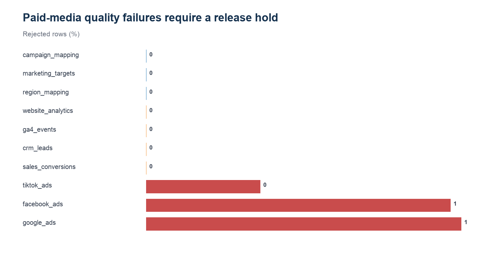

# REQ-06 — Recommendation trust and data-quality hold

**Scenario type:** Modeled stakeholder request / portfolio case study
**Modeled requester:** Marketing Analytics Manager

## 1. Request ID

`REQ-06`

## 2. Modeled requester / persona

Marketing Analytics Manager. This is a functional persona, not a record of an actual stakeholder interaction.

## 3. Original business question

> Can the campaign recommendation be trusted, or should reporting and actions be held?

## 4. Clarifying questions

- Which recommendation? — Any current campaign action that depends on paid-media source data.
- What constitutes a hold? — A source freshness/quality failure or the existing campaign-level DATA QUALITY HOLD override.
- Can a warning be released? — Only after documented review; warnings are not silently treated as healthy.

## 5. Restated analytical question

Do source-level quality status and campaign-level hold logic agree, and what release decision follows?

## 6. Data sources / marts used

- `mart.mart_data_quality_monitoring`
- `mart.mart_campaign_action_center`
- `data/exports/demo_mart_source_health.csv`

## 7. Relevant grain

One row per monitored source; compared with one row per campaign action and reporting month.

## 8. SQL and/or Python analysis

- Reproducible Python: `../build_analysis_pack.py`
- Inspectable SQL: `analysis.sql`

## 9. Validation / reconciliation checks

- Source rows, rejected rows, failed counts, severity, and status come from the governed monitoring mart.
- Rejection rate is recalculated from source rows.
- Campaign-level holds are counted from data_quality_status.
- Release decision maps freshness/quality failures → HOLD, quality_warning → REVIEW, healthy → RELEASE.

## 10. Output table

See `result.csv`.

## 11. Visualization

## 12. What happened? — OBSERVATION

Reporting should be held because all 3 paid-media sources are in quality_failure status with error severity and rejected rows. Another 4 sources require review under quality_warning status. The current action mart emits 1 campaign-level quality hold because its override checks campaign-ID completeness. That control gap requires a manual release hold until freshness and paid-source failures are resolved or explicitly accepted.

## 13. Why did it happen? — INTERPRETATION

The campaign action override checks missing campaign IDs, while the source monitor also captures contract failures and rejected rows. Both controls are valid, but they operate at different grains and currently do not cascade automatically.

## 14. So what? — BUSINESS INTERPRETATION

A performance-looking campaign row can pass its campaign-ID check while depending on stale or failed sources. Releasing it without source review would overstate reporting trust.

## 15. Recommended action — HUMAN REVIEW REQUIRED

Apply a manual DATA QUALITY HOLD to paid-media recommendations, resolve or formally accept the failed source-contract results, rerun monitoring, and release only after both source and campaign controls pass.

## 16. Risks / caveats

- A freshness or quality failure does not prove every metric is wrong; it means the recommendation is not sufficiently controlled for release.
- This analysis recommends a portfolio workflow decision, not a live platform action.
- All marketing business data is generated/synthetic.

## 17. Evidence / provenance

`validation.json` records the input hashes, result hash, schema, row count, and checks. All business data is generated/synthetic. The bounded real GA4 path is not used in this request.

## 18. Final concise stakeholder response

Reporting should be held because all 3 paid-media sources are in quality_failure status with error severity and rejected rows. Another 4 sources require review under quality_warning status. The current action mart emits 1 campaign-level quality hold because its override checks campaign-ID completeness. That control gap requires a manual release hold until freshness and paid-source failures are resolved or explicitly accepted.
