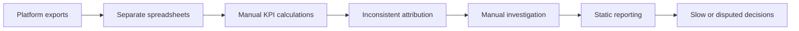
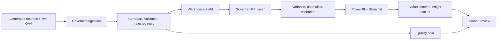

# Marketing Reporting Process Analysis

## As-Is process

The modeled current state represents a common export-driven reporting workflow. It is not a description of an observed employer process.

| Process issue | Analytical consequence | Control gap |
|---|---|---|
| Independent exports | Campaign/source totals drift | No governed reconciliation |
| Spreadsheet formulas | ROAS/CAC definitions vary | No KPI catalog or test |
| Manual campaign mapping | Unmapped records fragment results | No conformed dimensions |
| Late conversions | Historical performance changes silently | No watermarks/incremental handling |
| Ad hoc investigation | Driver logic cannot be reproduced | No deterministic variance or anomaly analysis |
| Static presentation | Exceptions and quality risk are buried | No action center or release gate |

## To-Be process

The generated marketing path and live GA4 path remain separate through ingestion and staging, then converge only in governed analytical outputs where their origins are explicit.

## Decision controls

| Stage | Control | Output |
|---|---|---|
| Source | Execution status and source contract | Source assessment, contracts, manifests |
| Landing | Hash, batch, watermark, accepted/rejected counts | Ingestion logs and quality reports |
| Warehouse | Grain, keys, incremental rules | dbt models and tests |
| KPI | Definition, formula, owner, exclusions | KPI catalog and DAX catalog |
| Analysis | Method, baseline, assumptions, limitations | Variance, anomaly, forecast, scenario outputs |
| Recommendation | Rule, supporting metrics, priority, quality override | Action-center marts |
| Reporting | Relationship, filter, usability, acceptance checks | Power BI semantic/page assets and UAT workbook |
| Distribution | Reconciliation and quality gate | Decision-intelligence packet and quality results |

## Expected process outcome

The target process replaces repeated manual reconciliation with reusable checks and traceable outputs. It improves auditability and decision support without assigning unmeasured time savings or business impact.
