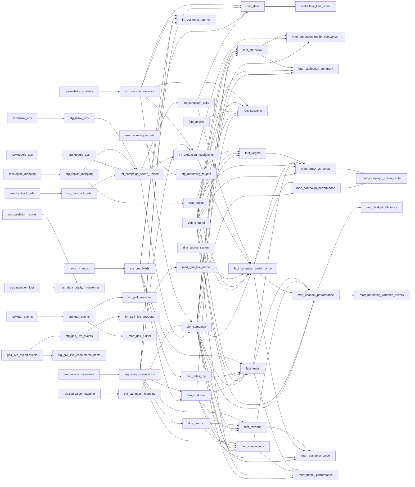

# Generated Lineage Diagram

```mermaid
flowchart LR
    int_campaign_spend_unified["int_campaign_spend_unified"] --> int_attribution_touchpoints["int_attribution_touchpoints"]
    stg_sales_conversions["stg_sales_conversions"] --> int_attribution_touchpoints["int_attribution_touchpoints"]
    stg_website_analytics["stg_website_analytics"] --> int_attribution_touchpoints["int_attribution_touchpoints"]
    int_campaign_spend_unified["int_campaign_spend_unified"] --> int_campaign_daily["int_campaign_daily"]
    stg_facebook_ads["stg_facebook_ads"] --> int_campaign_spend_unified["int_campaign_spend_unified"]
    stg_google_ads["stg_google_ads"] --> int_campaign_spend_unified["int_campaign_spend_unified"]
    stg_region_mapping["stg_region_mapping"] --> int_campaign_spend_unified["int_campaign_spend_unified"]
    stg_tiktok_ads["stg_tiktok_ads"] --> int_campaign_spend_unified["int_campaign_spend_unified"]
    stg_crm_leads["stg_crm_leads"] --> int_customer_journey["int_customer_journey"]
    stg_sales_conversions["stg_sales_conversions"] --> int_customer_journey["int_customer_journey"]
    stg_website_analytics["stg_website_analytics"] --> int_customer_journey["int_customer_journey"]
    stg_ga4_live_events["stg_ga4_live_events"] --> int_ga4_live_sessions["int_ga4_live_sessions"]
    stg_ga4_events["stg_ga4_events"] --> int_ga4_sessions["int_ga4_sessions"]
    int_campaign_spend_unified["int_campaign_spend_unified"] --> dim_campaign["dim_campaign"]
    stg_campaign_mapping["stg_campaign_mapping"] --> dim_campaign["dim_campaign"]
    stg_website_analytics["stg_website_analytics"] --> dim_campaign["dim_campaign"]
    stg_crm_leads["stg_crm_leads"] --> dim_customer["dim_customer"]
    stg_sales_conversions["stg_sales_conversions"] --> dim_customer["dim_customer"]
    int_campaign_daily["int_campaign_daily"] --> dim_date["dim_date"]
    stg_crm_leads["stg_crm_leads"] --> dim_date["dim_date"]
    stg_sales_conversions["stg_sales_conversions"] --> dim_date["dim_date"]
    stg_website_analytics["stg_website_analytics"] --> dim_date["dim_date"]
    stg_sales_conversions["stg_sales_conversions"] --> dim_product["dim_product"]
    stg_region_mapping["stg_region_mapping"] --> dim_region["dim_region"]
    stg_crm_leads["stg_crm_leads"] --> dim_sales_rep["dim_sales_rep"]
    dim_campaign["dim_campaign"] --> fact_attribution["fact_attribution"]
    dim_channel["dim_channel"] --> fact_attribution["fact_attribution"]
    dim_customer["dim_customer"] --> fact_attribution["fact_attribution"]
    int_attribution_touchpoints["int_attribution_touchpoints"] --> fact_attribution["fact_attribution"]
    dim_campaign["dim_campaign"] --> fact_campaign_performance["fact_campaign_performance"]
    dim_channel["dim_channel"] --> fact_campaign_performance["fact_campaign_performance"]
    dim_region["dim_region"] --> fact_campaign_performance["fact_campaign_performance"]
    dim_source_system["dim_source_system"] --> fact_campaign_performance["fact_campaign_performance"]
    int_attribution_touchpoints["int_attribution_touchpoints"] --> fact_campaign_performance["fact_campaign_performance"]
    int_campaign_daily["int_campaign_daily"] --> fact_campaign_performance["fact_campaign_performance"]
    dim_campaign["dim_campaign"] --> fact_conversions["fact_conversions"]
    dim_customer["dim_customer"] --> fact_conversions["fact_conversions"]
    dim_product["dim_product"] --> fact_conversions["fact_conversions"]
    stg_sales_conversions["stg_sales_conversions"] --> fact_conversions["fact_conversions"]
    dim_campaign["dim_campaign"] --> fact_leads["fact_leads"]
    dim_channel["dim_channel"] --> fact_leads["fact_leads"]
    dim_customer["dim_customer"] --> fact_leads["fact_leads"]
    dim_region["dim_region"] --> fact_leads["fact_leads"]
    dim_sales_rep["dim_sales_rep"] --> fact_leads["fact_leads"]
    stg_crm_leads["stg_crm_leads"] --> fact_leads["fact_leads"]
    dim_campaign["dim_campaign"] --> fact_revenue["fact_revenue"]
    dim_customer["dim_customer"] --> fact_revenue["fact_revenue"]
    dim_product["dim_product"] --> fact_revenue["fact_revenue"]
    stg_sales_conversions["stg_sales_conversions"] --> fact_revenue["fact_revenue"]
    dim_campaign["dim_campaign"] --> fact_sessions["fact_sessions"]
    dim_channel["dim_channel"] --> fact_sessions["fact_sessions"]
    dim_device["dim_device"] --> fact_sessions["fact_sessions"]
    dim_region["dim_region"] --> fact_sessions["fact_sessions"]
    stg_website_analytics["stg_website_analytics"] --> fact_sessions["fact_sessions"]
    dim_channel["dim_channel"] --> fact_targets["fact_targets"]
    dim_region["dim_region"] --> fact_targets["fact_targets"]
    stg_marketing_targets["stg_marketing_targets"] --> fact_targets["fact_targets"]
    dim_date["dim_date"] --> metricflow_time_spine["metricflow_time_spine"]
    dim_campaign["dim_campaign"] --> mart_attribution_model_comparison["mart_attribution_model_comparison"]
    dim_channel["dim_channel"] --> mart_attribution_model_comparison["mart_attribution_model_comparison"]
    fact_attribution["fact_attribution"] --> mart_attribution_model_comparison["mart_attribution_model_comparison"]
    dim_campaign["dim_campaign"] --> mart_attribution_summary["mart_attribution_summary"]
    dim_channel["dim_channel"] --> mart_attribution_summary["mart_attribution_summary"]
    fact_attribution["fact_attribution"] --> mart_attribution_summary["mart_attribution_summary"]
    mart_channel_performance["mart_channel_performance"] --> mart_budget_efficiency["mart_budget_efficiency"]
    mart_campaign_performance["mart_campaign_performance"] --> mart_campaign_action_center["mart_campaign_action_center"]
    mart_target_vs_actual["mart_target_vs_actual"] --> mart_campaign_action_center["mart_campaign_action_center"]
    dim_campaign["dim_campaign"] --> mart_campaign_performance["mart_campaign_performance"]
    fact_campaign_performance["fact_campaign_performance"] --> mart_campaign_performance["mart_campaign_performance"]
    dim_campaign["dim_campaign"] --> mart_channel_performance["mart_channel_performance"]
    dim_channel["dim_channel"] --> mart_channel_performance["mart_channel_performance"]
    fact_campaign_performance["fact_campaign_performance"] --> mart_channel_performance["mart_channel_performance"]
    fact_conversions["fact_conversions"] --> mart_channel_performance["mart_channel_performance"]
    fact_leads["fact_leads"] --> mart_channel_performance["mart_channel_performance"]
    dim_campaign["dim_campaign"] --> mart_customer_value["mart_customer_value"]
    dim_customer["dim_customer"] --> mart_customer_value["mart_customer_value"]
    fact_campaign_performance["fact_campaign_performance"] --> mart_customer_value["mart_customer_value"]
    fact_revenue["fact_revenue"] --> mart_customer_value["mart_customer_value"]
    ops_ingestion_logs["ops.ingestion_logs"] --> mart_data_quality_monitoring["mart_data_quality_monitoring"]
    ops_validation_results["ops.validation_results"] --> mart_data_quality_monitoring["mart_data_quality_monitoring"]
    dim_campaign["dim_campaign"] --> mart_funnel_performance["mart_funnel_performance"]
    dim_channel["dim_channel"] --> mart_funnel_performance["mart_funnel_performance"]
    fact_conversions["fact_conversions"] --> mart_funnel_performance["mart_funnel_performance"]
    fact_leads["fact_leads"] --> mart_funnel_performance["mart_funnel_performance"]
    stg_ga4_events["stg_ga4_events"] --> mart_ga4_funnel["mart_ga4_funnel"]
    int_ga4_live_sessions["int_ga4_live_sessions"] --> mart_ga4_live_funnel["mart_ga4_live_funnel"]
    mart_channel_performance["mart_channel_performance"] --> mart_marketing_variance_drivers["mart_marketing_variance_drivers"]
    dim_channel["dim_channel"] --> mart_target_vs_actual["mart_target_vs_actual"]
    dim_region["dim_region"] --> mart_target_vs_actual["mart_target_vs_actual"]
    fact_campaign_performance["fact_campaign_performance"] --> mart_target_vs_actual["mart_target_vs_actual"]
    fact_leads["fact_leads"] --> mart_target_vs_actual["mart_target_vs_actual"]
    fact_targets["fact_targets"] --> mart_target_vs_actual["mart_target_vs_actual"]
    raw_campaign_mapping["raw.campaign_mapping"] --> stg_campaign_mapping["stg_campaign_mapping"]
    raw_crm_leads["raw.crm_leads"] --> stg_crm_leads["stg_crm_leads"]
    raw_facebook_ads["raw.facebook_ads"] --> stg_facebook_ads["stg_facebook_ads"]
    raw_ga4_events["raw.ga4_events"] --> stg_ga4_events["stg_ga4_events"]
    ga4_live_export_events["ga4_live_export.events"] --> stg_ga4_live_ecommerce_items["stg_ga4_live_ecommerce_items"]
    ga4_live_export_events["ga4_live_export.events"] --> stg_ga4_live_events["stg_ga4_live_events"]
    raw_google_ads["raw.google_ads"] --> stg_google_ads["stg_google_ads"]
    raw_marketing_targets["raw.marketing_targets"] --> stg_marketing_targets["stg_marketing_targets"]
    raw_region_mapping["raw.region_mapping"] --> stg_region_mapping["stg_region_mapping"]
    raw_sales_conversions["raw.sales_conversions"] --> stg_sales_conversions["stg_sales_conversions"]
    raw_tiktok_ads["raw.tiktok_ads"] --> stg_tiktok_ads["stg_tiktok_ads"]
    raw_website_analytics["raw.website_analytics"] --> stg_website_analytics["stg_website_analytics"]
```
