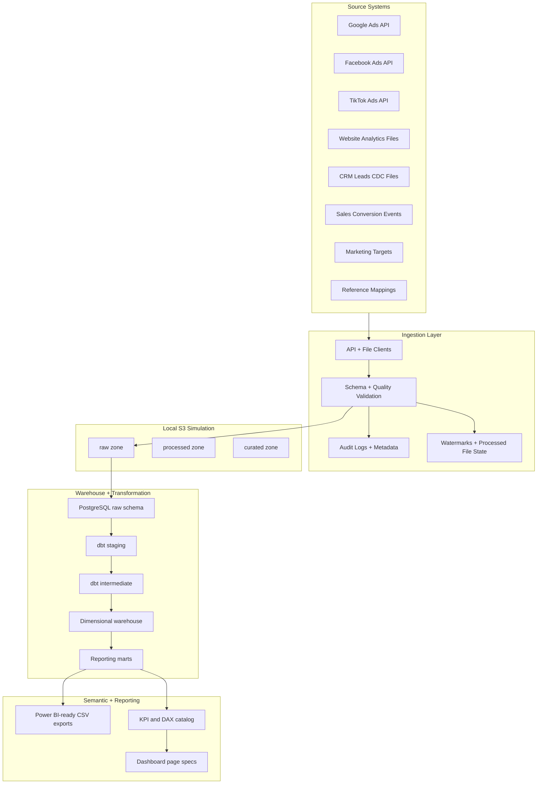

# Architecture Summary

## Platform Layers

## Engineering Design Choices

- Generated sources include dirty data, late-arriving records, schema drift, duplicate IDs, null spend, and attribution ambiguity.
- The ingestion layer writes audit logs, source summaries, validation reports, rejected rows, and watermarks.
- dbt separates source cleaning, cross-source conformance, dimensional facts/dimensions, and BI marts.
- Incremental facts use `updated_at` filters to support idempotent reruns and late-arriving updates.
- The semantic layer documents business definitions before dashboard creation, reducing metric drift.

## GCP extension

The local architecture remains the default reproducible path. GCS, BigQuery, dbt-bigquery, empty Secret Manager containers, and the project-site GA4 Daily export are also verified with small controlled workloads, as documented in `docs/cloud_architecture.md` and `docs/P2_LIVE_GCP_VALIDATION.md`. Google Ads, Meta Ads, TikTok Ads, and Power BI Service require separate authorization or deployment.
