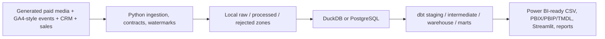
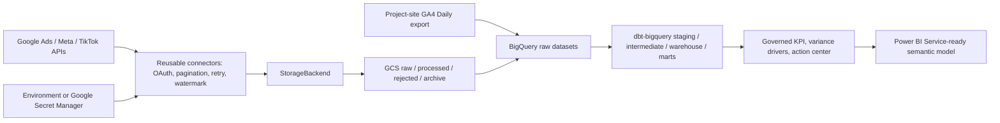

# Local and Cloud Architecture

## Local mode

## Cloud mode (foundation and GA4 path live-verified)

Cloud clients use lazy imports, so missing cloud packages or credentials do not break local tests. On 2026-08-18, a 21-resource Terraform plan was applied and verified without changes or destroys. GCS object write/read/delete, a 70-row BigQuery/dbt run, and Secret Manager metadata access passed; secret containers remain empty. On 2026-08-20, two GA4 Daily export tables and the date-filtered live dbt selector were verified. Vendor advertising APIs and Power BI Service require separate authorization and deployment.

| Component | Local | Cloud | Verification state |
|---|---|---|---|
| Sources | Generated files and local API simulator | Vendor API plus GA4 Daily export | Local sources and project-site GA4 verified; vendor APIs require credentials |
| Storage | Local filesystem | GCS | Private bucket and small object smoke test verified |
| Warehouse | DuckDB/PostgreSQL | BigQuery | Local build, small cloud load, and GA4 relations verified |
| Transform | dbt-duckdb/dbt-postgres | dbt-bigquery | DuckDB and date-filtered BigQuery selectors verified |
| Secrets | Environment variables | Google Secret Manager | Empty containers and metadata IAM verified; no values accessed |
| BI | Streamlit/Power BI Desktop | Power BI Service | Desktop assets implemented; Service manual |
