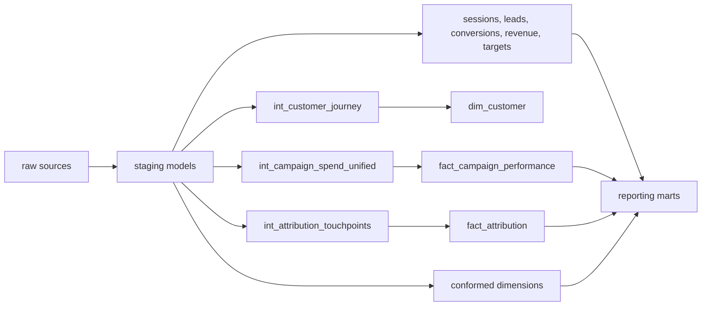

# dbt Lineage

## Model Layers

- `staging`: type casting, naming, source-specific cleanup, channel normalization, CDC delete filtering.
- `intermediate`: cross-source unions, journey stitching, attribution touchpoint eligibility.
- `marts/core`: dimensional warehouse facts and dimensions.
- `marts/reporting`: business-ready datasets for executive and analyst dashboards.

## dbt Tests

- Required source fields and accepted values.
- Unique/not-null warehouse keys where appropriate.
- Custom KPI relationship assertion for impossible campaign metrics.
- Source freshness definitions for raw tables.
