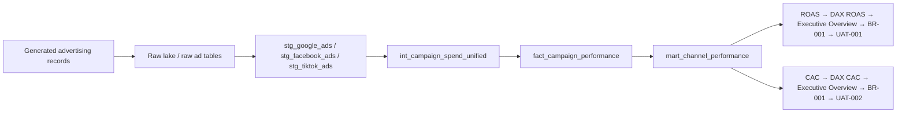
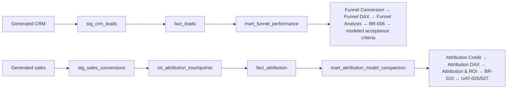
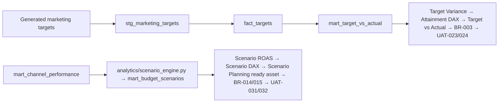
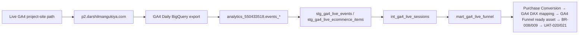

# KPI Lineage

These chains summarize repository-backed lineage. The seven-page PBIX and the additional Power BI-ready page specifications are documented separately.

```mermaid
flowchart LR
  Ads["Generated advertising records"] --> Raw["Raw lake / raw ad tables"] --> Stg["stg_google_ads / stg_facebook_ads / stg_tiktok_ads"] --> Unified["int_campaign_spend_unified"] --> Fact["fact_campaign_performance"] --> Channel["mart_channel_performance"]
  Channel --> ROAS["ROAS → DAX ROAS → Executive Overview → BR-001 → UAT-001"]
  Channel --> CAC["CAC → DAX CAC → Executive Overview → BR-001 → UAT-002"]
```

```mermaid
flowchart LR
  CRM["Generated CRM"] --> CRMStg["stg_crm_leads"] --> Leads["fact_leads"] --> Funnel["mart_funnel_performance"] --> FunnelKPI["Funnel Conversion → Funnel DAX → Funnel Analysis → BR-006 → modeled acceptance criteria"]
  Sales["Generated sales"] --> SalesStg["stg_sales_conversions"] --> Touch["int_attribution_touchpoints"] --> Attr["fact_attribution"] --> AttrMart["mart_attribution_model_comparison"] --> AttrKPI["Attribution Credit → Attribution DAX → Attribution & ROI → BR-010 → UAT-026/027"]
```

```mermaid
flowchart LR
  Targets["Generated marketing targets"] --> TargetStg["stg_marketing_targets"] --> TargetFact["fact_targets"] --> TargetMart["mart_target_vs_actual"] --> TargetKPI["Target Variance → Attainment DAX → Target vs Actual → BR-003 → UAT-023/024"]
  ChannelMart["mart_channel_performance"] --> Scenario["analytics/scenario_engine.py → mart_budget_scenarios"] --> ScenarioKPI["Scenario ROAS → Scenario DAX → Scenario Planning ready asset → BR-014/015 → UAT-031/032"]
```

```mermaid
flowchart LR
  LiveGA4["Live GA4 project-site path"] --> Site["p2.darshilmangukiya.com"]
  Site["p2.darshilmangukiya.com"] --> GA4["GA4 Daily BigQuery export"] --> Events["analytics_550433518.events_*"] --> GA4Stg["stg_ga4_live_events / stg_ga4_live_ecommerce_items"] --> Sessions["int_ga4_live_sessions"] --> GA4Mart["mart_ga4_live_funnel"] --> Purchase["Purchase Conversion → GA4 DAX mapping → GA4 Funnel ready asset → BR-008/009 → UAT-020/021"]
```
