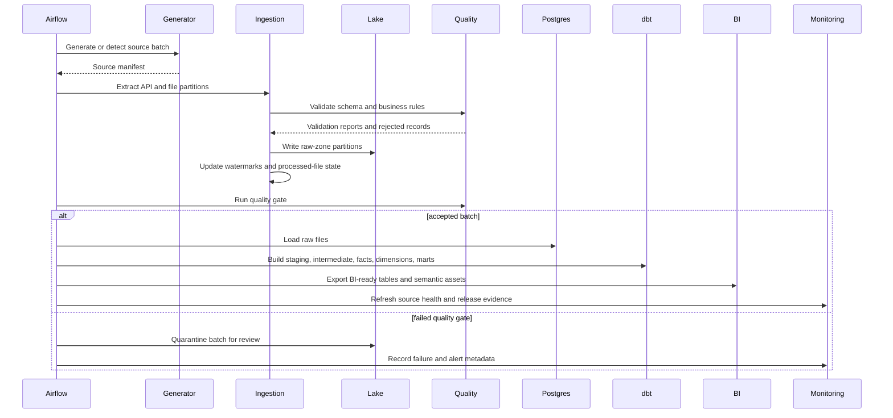

# Pipeline Workflow

The platform is organized as a daily batch-oriented marketing data pipeline with incremental state, source validation, warehouse loading, dbt transformations, BI exports, and monitoring outputs.

## End-to-End Flow

## Daily DAG Tasks

The Airflow DAG is implemented in `airflow/dags/marketing_platform_daily.py`.

| Task | Purpose |
|---|---|
| `generate_source_data` | Generate or locate the daily source batch |
| `ingest_to_lake` | Extract API/file inputs and write raw lake partitions |
| `validate_lake` | Run validation checks and produce quality summaries |
| `choose_load_path` | Branch based on validation outcome |
| `load_raw_to_postgres` | Load raw data into PostgreSQL |
| `dbt_build` | Build dbt staging, intermediate, core, and mart models |
| `export_powerbi_tables` | Export facts, dimensions, and marts for BI consumption |
| `refresh_source_health` | Refresh source health and monitoring outputs |

## Incremental Controls

- `data/logs/watermarks.json` tracks source-level high-water marks.
- `data/logs/processed_files.json` tracks file hashes and prevents duplicate reprocessing.
- ingestion metadata records batch IDs, file names, row counts, statuses, load type, and failure reasons.
- late-arriving conversion windows allow conversion records to be processed after their original touchpoint date.
- validation outputs separate accepted records from rejected records so bad data can be reviewed without losing batch context.

## Failure Handling

- extraction and load tasks are isolated by source/system boundary
- rejected rows are written with source, file, rule, and failure reason
- quality gate status is recorded in generated summaries
- Airflow callbacks capture task-level metadata
- monitoring outputs surface source freshness, quality status, and pipeline health
