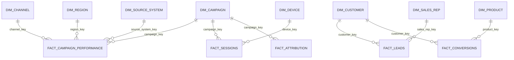

# Warehouse Model

## Core Grain

- `fact_campaign_performance`: one row per day, campaign, channel, source system, and reporting region.
- `fact_sessions`: one row per website session.
- `fact_leads`: one row per active CRM lead after CDC delete filtering.
- `fact_conversions`: one row per sales conversion after CDC delete filtering.
- `fact_revenue`: one row per conversion revenue event.
- `fact_targets`: one row per month, region, and channel target.
- `fact_attribution`: one row per conversion-touchpoint-model combination.

## Dimensions

- `dim_campaign`: SCD Type 2-style campaign dimension with canonical names, channel ownership, validity dates, and hash tracking.
- `dim_customer`: SCD Type 2-style acquisition and value segment dimension.
- `dim_channel`: conformed channel definitions.
- `dim_region`: conformed country, region, and sales territory.
- `dim_device`: BI-friendly device mapping.
- `dim_product`: product family grouping.
- `dim_sales_rep`: sales team grouping.
- `dim_source_system`: source ownership and ingestion method.
- `dim_date`: calendar spine.

## Optimization Notes

- Partition high-volume facts by event month in managed warehouses such as Snowflake, BigQuery, or Redshift.
- In PostgreSQL local mode, use date and foreign-key style indexes on fact tables.
- Cluster or sort campaign facts by `event_date`, `campaign_key`, and `channel_key`.
- Keep BI imports pointed at `mart.*` models unless analysts need drill-through to warehouse facts.
- Apply incremental dbt models to facts with `updated_at` lookbacks to handle late-arriving source updates.

## Relationship Sketch

